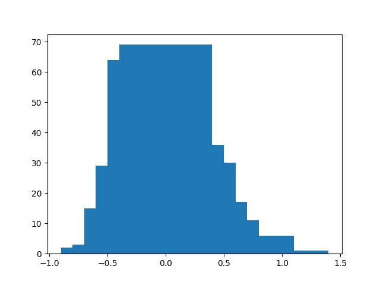

# Отчёт о проделанной работе
Статья: https://www.isca-speech.org/archive/pdfs/interspeech_2021/zhu21b_interspeech.pdf

Репозиторий авторов: https://github.com/gzhu06/Y-vector

# Какая задача решалась?

Допустим у нас есть N человек. Для каждого человека мы имеем набор его фраз, записанных в wav формате. Мы хотим создать модель F(x): X->Y, где X пространство звуковых файлов, а Y векторное пространство эмбеддингов некоторой размерности. Модель F должна работать так, чтобы фразы одного и того же человека, переведенные в пространство эмбеддингов, имели максимальное сходство, а фразы разных людей, различались. 

# В чём основная идея метода?

В самом начале статьи рассказывается об одномасштабных алгоритмах (использующие одну ветвь свёртки), которые показывают неплохие результаты. Авторы же статьи предлагают новый подход к данной задач: использовать три ветви свёртки для выделения признаков из звукового сигнала.

# Ход работы и эксперименты

1) Сначала я решил разобраться с архитектурой нейросети, которую предлагают использовать авторы. Модель условно можно поделить на две части:

    1. WaveEncoder - Получает на вход звуковой сигнал -> выдаёт тензор признаков
        Включает в себя:
        *3 последовательности сверток, каждая нацелена на выделение различных частот из звукового сигнала
        *Пулинговые слои для выделения основной информации
        *Сверточные слои для понижения размерности
        *SE-блоки сжатия и возбуждения для моделирования взаимозависимостей между каналами
    2. TDNN - Получает на вход тензор признаков -> выдаёт эмбеддинг
        *Нейронная сеть с временной задержкой
    
2)Датасет: Датасет, используемый авторами статьи, был временно недоступен. Датасет, который мне удалось найти содержал 36000 коротких видеофайлов различных фраз от 118 знаменитостей. Я перевёл эти файлы в wav формат и в качестве обучающей выборки использовал 5000 звуковых файлов. 

3) Построение модели: Модель я писал инструктируясь архитектурой, которую предлагали авторы статьи. Я написал WaveEncoder, изменив количество каналов, получемых после оперции свертки. Также я изменил количство и размер SE-блоков. Далее я написал TDNN, уменьшив количество слоёв и доступных парметров. Размер выходного эмбеддинга я выбрал равным 50.

4) Далее я приступил к реализации функции ошибки. В подобных задачах используется AM-Softmax. Она помогает модели понять насколько качественные эмбеддинга та производит. В качестве функции оптимизации я использовал SGD с шагом оптимизации 0.01.

5) После обучения модели, я тестировал её на своих данных. Я выбирал все звуковые файла, относящиеся к одному человеку, прогонял их через свою модель, а потом выбирал один из эмбеддингов в качестве anchor-эмбеддинга, отражающего класс рассматриваемого человека. Далее, пользуясь косинусной близостью, я сравнивал все остальные эмбеддинги с anchor-эмбеддингом. Числа по модулю близкие к единице означали высокое сходство ембеддинга с anchor, близкие к 0 - низкое, соответственно.  

# Как можно использовать полученный результат?
Задача идентификации очень популярна в машинном обучении. Уверен, что многие слышали о проблеме "коктейльной вечеринке". Метод многомасштабной кодировки, предложенный в статье, может пригодиться для более четкого распознавания голоса. Такой алгоритм можно имплементировать в устройство голосовых помощников. Они смогут хорошо реагировать на просьбы человека, даже если вокруг шумно и слышны голоса других людей. Также подобный метод можно успешно применять для голосовой аутентификации, повышая точность распознования личности.

# Мои результаты
После обучения, точность моей модели оставляла желать лучшего. Поэкспериментировав с размерами выходного эмбеддинга, количеством эпох обучения и настройками AM-Softmax, мне не удалось сильно увеличить точность своей модели. Осмысливая, полученные результаты и читая информацию по данной теме, я выяснил, что в силу небольшого опыта работы со звуковыми данными допустил ошибку, плохо предобработал звук. Таким образом, модель очень сильно сбивал шум в данных.

На картинке по оси X косинусное расстояние, по оси Y количество эмбеддингов имеющие данное косинусное расстояние. Как видно без препроцессинга модель плохо классифицирует голос одного и того же человека(большисвто эмбеддингов не похожи на anchor-эмбеддинг).

# Перспективы для улучшения
В первую очередь надо улучшить предобработку звукового сигнала. В качесвтве хорошего способа предобработки звука можно использовать метод извлечения набора цифровых полосовых фильтров(банк ЦПФ). Таким образом, можно расщепить сигнал на несколько компонент, избавиться от шума и предоставить модели более качественные данные для обучения.

